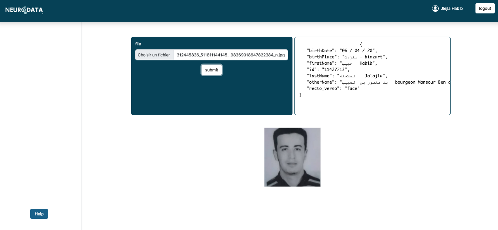

<div align="center">
  <a href="https://www.neurodata.tech/">
    
    </a>
</div>

<h1 align="center">NEURODATA ID Card Digitization Sample</h1>

** **

## ID Card Digitization and Information Extraction using Deep Learning Free API


Annotations include bounding boxes for each image and have the same name as the image name. You can find the example to train a model in python, by updating the api-key and model id in corresponding file.


** **

# Build an ID Card Info Extraction Model


<div align="center">
    
</div>

## Step 1: Get your free API Key
Get your free API Key from https://neurodata.tech/products

## Step 2: Sign up and verify your email
you will get a token for 100 requests for ID card extraction informations.


## Step 3: Upload Images For parsing
Get the results 

<div align="center">
    
</div>
** **

#Pipeline
###Corner Detection and Alignment
<div align="center">
    
</div>
###Recto/Verso Document detection
<div align="center">
    
</div>
###Text Detection
<div align="center">
    
</div>
###Recognize image text and final results with OCR and informations translation
####Final Result
```sh
{
   "birthDate": "06 / 04 / 20",
   "birthPlace": "بنزرت - binzart",
   "firstName": "حبيب   Habib",
   "id": "11427713",
   "lastName": "الجلاجلة   Jalajla",
   "otherName": "بذ منصور بن الحبيب   bourgeon Mansour Ben alhabib",
   "recto_verso": "face"
}
     
```


